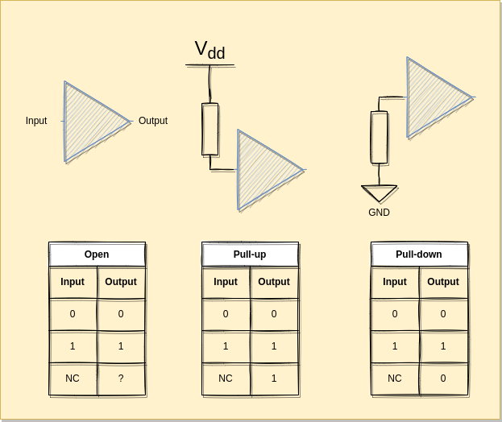

## Managing Inputs
We now want to talk to that FPGA. For that we have to declare an input.

```
LOCATE COMP "port_i" SITE "F12";
IOBUF PORT "port_i" PULLMODE=UP IO_TYPE=LVCMOS33;
```

Be really careful, the inputs on an FPGA are way more sensitive than on microcontrollers. Thankfully, really often you just burn that IO or a group of IOs so the FPGA still works but with less IOs.

Do not connect coils directly (relays, motors, speakers) and make sure you are using 3.3V logic (or lower if you defined lower in your LPF file) if you are connecting to something else.

The FPGA contains pull-ups and pull-downs that you can set at synthesis time:



For more details on how the ECP5 handles the IOs see: https://www.latticesemi.com/-/media/LatticeSemi/Documents/ApplicationNotes/EH/FPGA-TN-02032-1-3-ECP5-ECP5G-sysIO-Usage-Guide.ashx?document_id=50464

## Memory
In Verilog, you can create data types of arbitrary types:
```verilog
	reg [SIZE-1:0] buffer;
```
This will create a register of SIZE bits called buffer.

 To access a single bit, you use the bit index. Verilog uses zero-based indexing, so the least significant bit (LSB) is at index 0 and the most significant bit (MSB) is at index 7. For example, `buffer[0]` accesses the LSB of `buffer`, and `buffer[SIZE-1]` accesses the MSB.
 To access a range of bits, you use a colon to specify the bit range. For example, `buffer[3:0]` accesses the least significant 4 bits of `buffer`, and `buffer[7:4]` accesses the most significant 4 bits (assuming SIZE=8 here).

We can set the value of a register at the beginning of the life of the module:
```verilog
  initial begin
    buffer = 8'b01010101;
  end
```


## Code
follow.lpf:
``text
LOCATE COMP "clk_i" SITE "P6";
IOBUF PORT "clk_i" IO_TYPE=LVCMOS33;
FREQUENCY PORT "clk_i" 25 MHZ;

LOCATE COMP "led_o" SITE "P11";
IOBUF PORT "led_o" IO_TYPE=LVCMOS25;

LOCATE COMP "port_i" SITE "F12";
IOBUF PORT "port_i" PULLMODE=UP IO_TYPE=LVCMOS33;
``

follow.v
```verilog
module top(input clk_i, input port_i, output led_o);
   reg  led_reg;
   wire baseclk;

   clkdiv #(.DIV(200000)) slowclk (clk_i, baseclk);
   ring_buffer  buffer (baseclk, port_i, led_o);
endmodule


module ring_buffer (
  input wire clk,
  input wire data_in,
  output wire data_out
);
  reg [255:0] buffer;
  reg [7:0]   write_pointer;
  reg [7:0]   read_pointer;

  initial begin
    buffer = 256'b0000000000000000000000000000000000000000000011111111000000001111111100000000111111110000000011111111111111110000000011111111111111110000000011111111111111110000000011111111000000001111111100000000111111110000000000000000000000000000000000000000000000000000;
  end

  always @(posedge clk) begin
    buffer[write_pointer] <= data_in;
    write_pointer <= write_pointer + 1;
    read_pointer  <= read_pointer + 1;
  end

  assign data_out = buffer[read_pointer];

endmodule


module clkdiv #(parameter DIV = 24'd5000)(
    input wire clk_i,
    output wire clk_o
    );

    reg [24:0] count = 25'b0;
    reg clk_o_internal = 1;
    //on this board we have a 25MHz clock

    always @(posedge clk_i) begin
        count <= count + 25'b1;
        if(count == DIV) begin
            count <= 25'b0;
            clk_o_internal <= ~clk_o_internal;
        end
    end
    assign clk_o = clk_o_internal;
endmodule

```

And to build it:
```shell
yosys -p "synth_ecp5 -top top -json follow.json" follow.v
nextpnr-ecp5 --json follow.json --textcfg follow.config --25k --package CABGA256 --lpf follow.lpf
ecppack --svf follow.svf follow.config follow.bit
```

The you upload with
```shell
openFPGALoader -b "colorlight-i5" --freq "16000000" follow.svf
```
